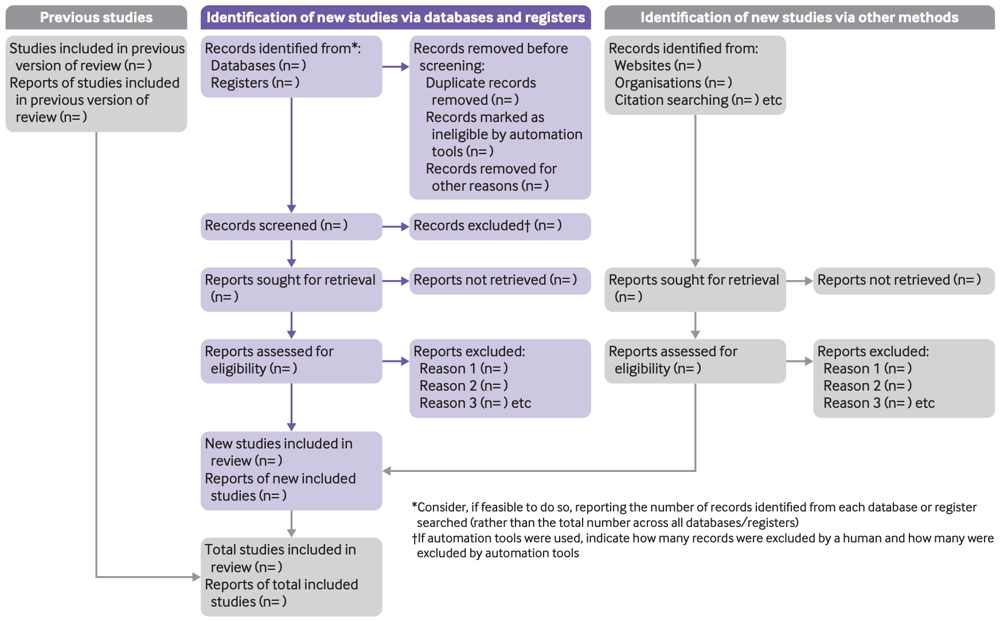

When conducting a systematic literature review (SLR), 
**PRISMA 2020 (Preferred Reporting Items for Systematic Reviews and Meta-Analyses)** is the most widely accepted reporting guideline. 
It provides a transparent and standardized framework for documenting how studies are identified, screened, assessed for eligibility, and included in a systematic review.

PRISMA does not prescribe *how* to conduct a systematic review. 
Instead, it focuses on *how to report* the review process clearly so that readers can understand, evaluate, and reproduce the methodology.

<!--more-->

## Why use PRISMA?

Following PRISMA helps researchers:

- Improve the transparency and reproducibility of their systematic reviews.
- Minimize reporting bias by documenting every stage of the review process.
- Clearly explain how studies were identified, selected, and excluded.
- Increase the credibility and quality of their research.
- Meet the reporting requirements of many journals and conferences.

## The PRISMA 2020 Structure

PRISMA 2020 consists of several key components.

### 1. PRISMA 2020 Checklist

The PRISMA 2020 checklist consists of **27 reporting items** organized into seven sections. It helps ensure that every important aspect of a systematic review is reported clearly and transparently.

| Section               | Item(s) | Description                                                                                                                                                                                                                          |
| --------------------- | :-----: | ------------------------------------------------------------------------------------------------------------------------------------------------------------------------------------------------------------------------------------ |
| **Title**             |    1    | Identify the report as a systematic review.                                                                                                                                                                                          |
| **Abstract**          |    2    | Provide a structured abstract following the PRISMA 2020 for Abstracts checklist.                                                                                                                                                     |
| **Introduction**      |   3–4   | Describe the rationale for the review and clearly state the review objectives or research questions.                                                                                                                                 |
| **Methods**           |   5–15  | Report eligibility criteria, information sources, search strategy, selection process, data collection, data items, risk of bias assessment, effect measures, synthesis methods, reporting bias assessment, and certainty assessment. |
| **Results**           |  16–22  | Describe study selection, study characteristics, risk of bias, individual study results, synthesis results, reporting bias, and certainty of evidence.                                                                               |
| **Discussion**        |    23   | Interpret the findings, discuss limitations of both the included evidence and the review process, and suggest implications for future research.                                                                                      |
| **Other Information** |  24–27  | Report registration details, protocol, sources of financial or non-financial support, competing interests, and availability of data, code, and other materials.                                                                      |

Rather than being a writing template, the checklist serves as a quality assurance tool to ensure that no important information is omitted.

#### PRISMA 2020 for Abstracts checklist

| Section | Item(s) | Description |
|---------|:-------:|-------------|
| **Title** | 1 | Identify the report as a systematic review. |
| **Background** | 2 | State the main objective or research question addressed by the review. |
| **Methods** | 3–6 | Describe the eligibility criteria, information sources (e.g., databases), date of the last search, and methods used to assess the risk of bias in the included studies. |
| **Results** | 7–10 | Report the number and characteristics of included studies, summarize the main findings, describe the limitations of the evidence, and provide an interpretation of the results. |
| **Other** | 11–12 | Report the primary source of funding and provide the registration number and registry name (if applicable). |

### 2. PRISMA Flow Diagram

The flow diagram helps readers quickly understand how the final set of studies was obtained, typically including three stages:

– Records previous studies
– Identify new study through database and registers.
– Identify new study through other methods.

## Is PRISMA Enough?

PRISMA provides an framework for reporting systematic reviews, but it is only one part of the review process.

Researchers still need to carefully:

- Define research questions.
- Develop a search strategy.
- Select appropriate databases.
- Screen studies systematically.
- Assess study quality.
- Synthesize the evidence.

In other words, PRISMA tells readers **what should be reported**, not **how to perform every step** of the review.

## Final Thoughts

If you are new to systematic literature reviews, learning PRISMA 2020 is a great starting point. It has become the reporting standard adopted by thousands of journals across medicine, computer science, engineering, education, psychology, and many other disciplines.

Whether you are conducting your first literature review or preparing a manuscript for publication, following PRISMA will help make your review more transparent, reproducible, and trustworthy.

## References

- Page, M. J., McKenzie, J. E., Bossuyt, P. M., Boutron, I., Hoffmann, T. C., Mulrow, C. D., ... & Moher, D. (2021). The PRISMA 2020 statement: an updated guideline for reporting systematic reviews. bmj, 372.
- Page, M. J., Moher, D., Bossuyt, P. M., Boutron, I., Hoffmann, T. C., Mulrow, C. D., ... & McKenzie, J. E. (2021). PRISMA 2020 explanation and elaboration: updated guidance and exemplars for reporting systematic reviews. bmj, 372.
